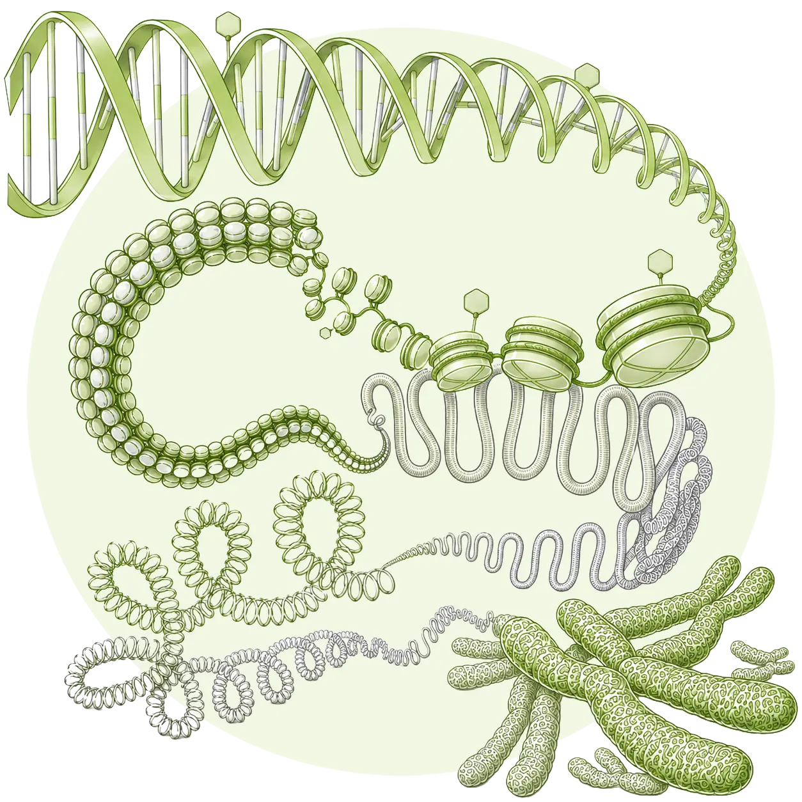

::: {.home-container}
::: {.home-grid-parent}
::: {.home-grid-child-left}

### NBIS Workshop
## **Epigenomics Data Analysis** From Bulk to Single Cell

An introduction to best practice bioinformatics methods for processing, analyses and integration of epigenomics data. This online workshop 
includes lectures, programming tutorials and interactive group sessions.

---

::: small
Updated:   at  .
:::

:::
:::{.home-grid-child-right}

{.nolightbox}

:::
:::
:::
